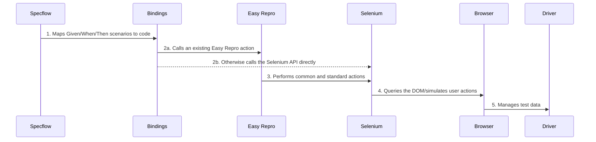

# Contributing

Please first discuss the change you wish to make via an issue before making a change. 

To build this project locally, you will need: 
- [Visual Studio 2020](https://visualstudio.microsoft.com/vs/)
- [SpecFlow for Visual Studio 2022](https://marketplace.visualstudio.com/items?itemName=TechTalkSpecFlowTeam.SpecFlowForVisualStudio2022)
- [.NET Framework 4.6.2 Developer Pack](https://dotnet.microsoft.com/en-us/download/dotnet-framework/net462)
- [Node and NPM](https://nodejs.org/en/download/)

## Architechture 

This project fundermentally utilises [Selenium](https://www.selenium.dev/) to automate user actions in the browser with the support of [Easy Repro](https://github.com/Microsoft/EasyRepro), which extends Selenium for Model-Driven apps. 

Typically the use of EasyRepro is preferred due to it's backing from Microsoft and the community although when an action isn't working, some temporary custom code will be used until the issue has been resolved. This is also the case in the rare instance that EasyRepro doesn't support a particular action. 



In addition to the Specflow bindings, there is a custom "driver" that wraps the [Model-Driven Client-Side API](https://learn.microsoft.com/en-us/power-apps/developer/model-driven-apps/clientapi/reference) to support test data setup via the Dataverse API. This is written in TypeScript and compiled to JavaScript before being bundled in the DLL. 

## Testing 

For a PR to be successfully merged, we aim for all tests to pass. Sometimes this isn't possible as the Power Platform changes, our tests aren't always kept up to date. We do require that there are tests for new/changed features and these. 


In order to test the library locally, please follow these steps: 

1. Open the solution in Visual Studio - we've found this has the best developer experience. Install the [SpecFlow extension](https://marketplace.visualstudio.com/items?itemName=TechTalkSpecFlowTeam.SpecFlowForVisualStudio2022) to add intellisense to the `.feature` files.
1. [Optional] Create a PowerApps environment. You need a PowerApps environment to execute the tests against so if you don't have System Administrator access to an existing one, we recommend using the free [Developer Plan](https://powerapps.microsoft.com/en-us/developerplan/).
1. [Adjust environment personalization](https://powerusers.microsoft.com/t5/Building-Power-Apps/Model-driven-app-dates-in-UK-format/td-p/1520165). Our tests expect a UK format for dates, times, and currency so please set this for any configured users (below).   
1. Configure the test suite to use your environment. The `power-apps-bindings.yml` file holds these details. Each property value can either point to a [user environment variable](https://www.alphr.com/environment-variables-windows-10/) or hold the raw value. <span style="color: red">**We strongly recommend environment variables to avoid committing your credentials.**</span> The following properties are required:
   - `url`
   - `applicationUser` - an [Application User](https://learn.microsoft.com/en-us/power-platform/admin/manage-application-users#create-an-application-user) must be added with the System Administrator role to your environment.
   - `users` - this can be your account, there is no need to create additional user. All username and password can be identical.  
1. Tweak config for local debugging. The `power-apps-bindings.yml` file is configured for use by the build server (that runs all tests before merge a PR) and therefore it is recommended to change the following properties without committing them. 
   - Change `headless` to `false` so you can observer the tests run.
   - Comment `driversPath` as this environment variable won't exist locally e.g. 
     ```yml 
     #driversPath: ChromeWebDriver
     ```

Other things to note:

- Running all tests are **not** required as the CI/PR build will do these. Test and verify only the steps or features you have impacted or made changes to.
- The first time you run the test suite, a managed solution will be installed into the environment which takes a couple minutes. If the first test run times out, try again - it was likely due to this. 
- At times when building a solution, it fails and you receive some MSBuild.exe errors or warnings. This prevents you from cancelling the build process as it hangs. You can stop or kill the MSBuild.exe process by starting the Task Manager and ending the process - you can close the Visual Studio and restart it if this doesn't work. You can also run this code `taskkill /f /im chromedriver.exe` on your terminal. 

## Pull request process

1. Ensure that there are automated tests that cover any changes 
1. Update the README.md with details of any significant changes to functionality
1. Ensure that your commit messages increment the version using [GitVersion syntax](https://gitversion.readthedocs.io/en/latest/input/docs/more-info/version-increments/). If no message is found then the patch version will be incremented by default.
1. You may merge the pull request once it meets all of the required checks. If you do not have permision, a reviewer will do it for you

## Useful Resources
- [A presentation on the SpecFlowBinding and EasyRepro setup with demo](https://triciasinclair.com/2020/11/30/using-specflow-and-easyrepro-to-improve-automated-ui-testing/)
